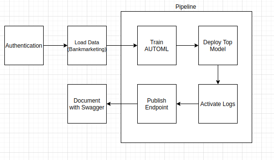

# Azure MLOPS - Deployment of AUTOML model and Automation Pipeline

In this project I will testing using Azure to build a model on the Bank Marketing Dataset to predict Term Deposit uptake and then deploy this as an API within Azure.

The main Components include:

* AutoML for building model
* Deployment API Endpoint (with benchhmarking)
* Pipeline for automation

## Architectural Diagram
 

## Key Steps

### Step 0 - Authentication

### Step 1 - Load Data

### Step 2 - Auto ML Experiment

List of all model experiments run

Top model from Automl Run

### Step 3 - Deploy the Best Model

Start Deployment of model

Model deployed

### Step 4 - Enable Logging

Run logs.py file which will allow application insights to be enabled

### Step 5 - Swagger Documentation

Run serve.py and swagger.sh to provide API documentation

### Step 6 - Consume Model Endpoints

Test the endpoint by running endpoint.py

Benchmark the API using Apache Benchmark

### Step 7 - Create and Publish a Pipeline

Start Pipeline of end to AutoML, building of endpoint and show runDetail Widget in Jupyter notebook

## Screen Recording

https://www.youtube.com/watch?v=AFL9PlokgjA

## Future Suggestions
- Increase training of Automl to build additional models might drive better performance
- Collect more data to improve the model accuracy as it gives additional examples
- Data cleaning and feature engineering will be helpful in improving data quality and provide more information that the model may generalise better