# Azure MLOPS - Deployment of AUTOML model and Automation Pipeline

In this project I will testing using Azure to build a model on the Bank Marketing Dataset to predict Term Deposit uptake and then deploy this as an API within Azure.

The main Components include:

* AutoML for building model
* Deployment API Endpoint (with benchhmarking)
* Pipeline for automation

## Architectural Diagram
*TODO*: Provide an architectual diagram of the project and give an introduction of each step. An architectural diagram is an image that helps visualize the flow of operations from start to finish. In this case, it has to be related to the completed project, with its various stages that are critical to the overall flow. For example, one stage for managing models could be "using Automated ML to determine the best model". 

## Key Steps

### Step 0 - Authentication

### Step 1 - Load Data

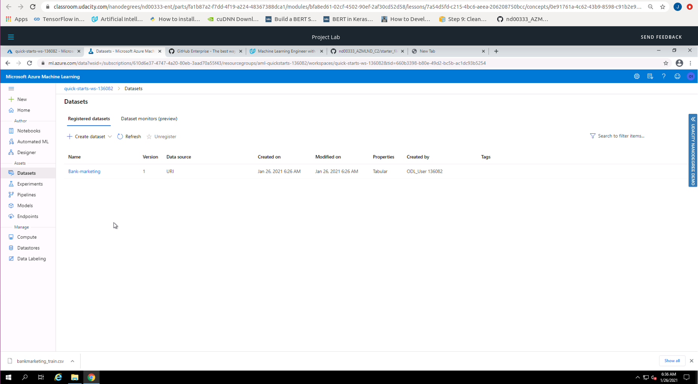

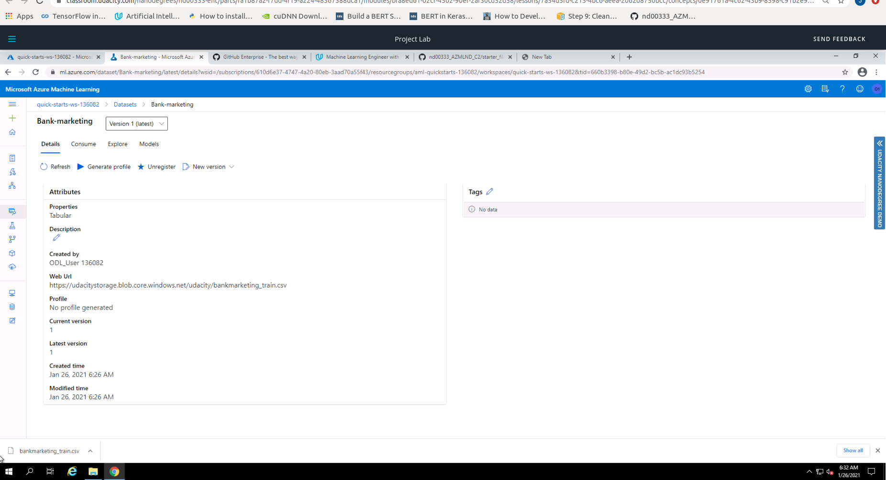

### Step 2 - Auto ML Experiment

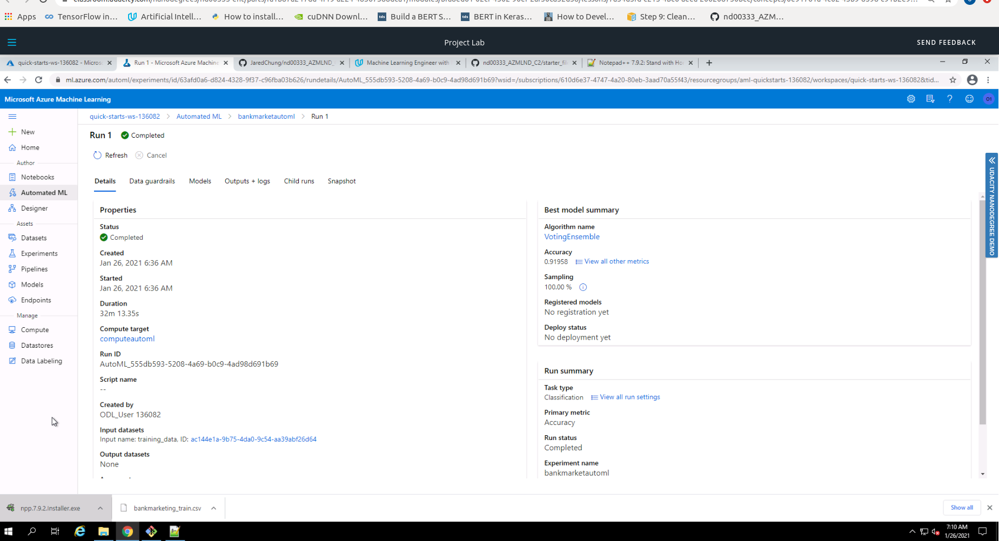

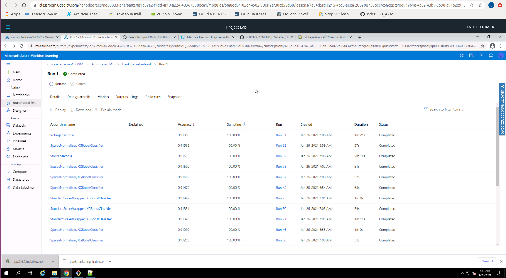

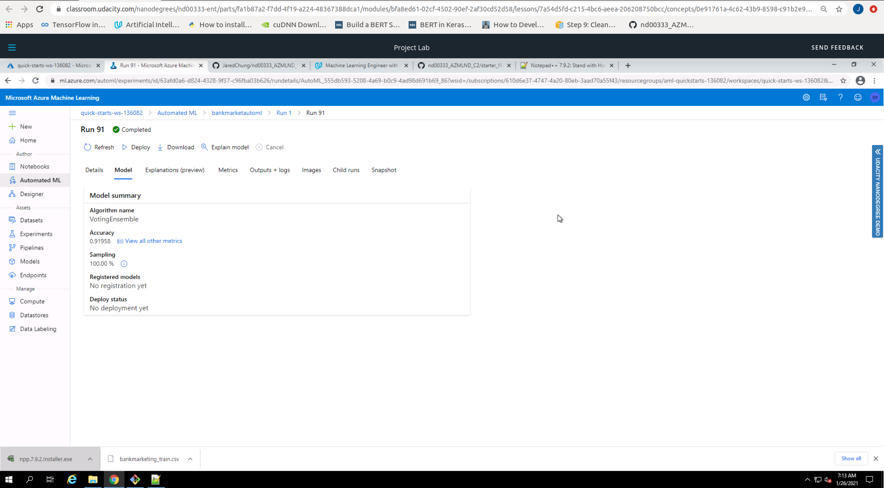

### Step 3 - Deploy the Best Model

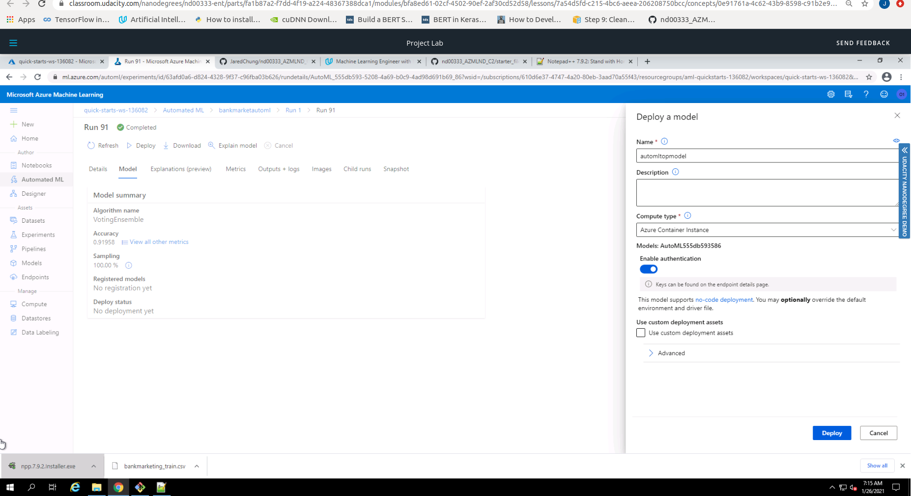

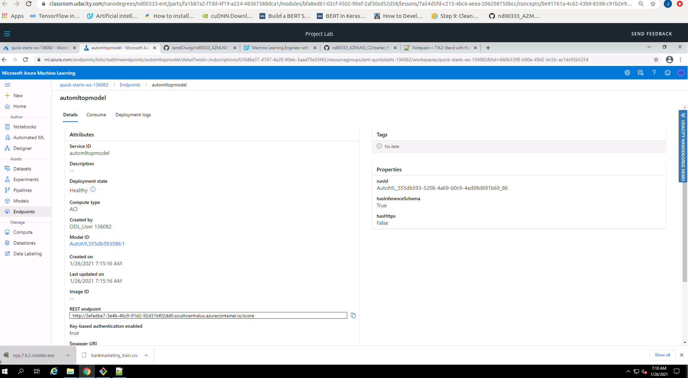

### Step 4 - Enable Logging

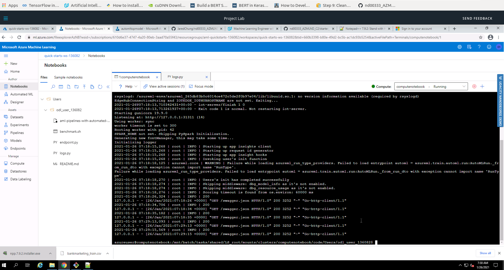

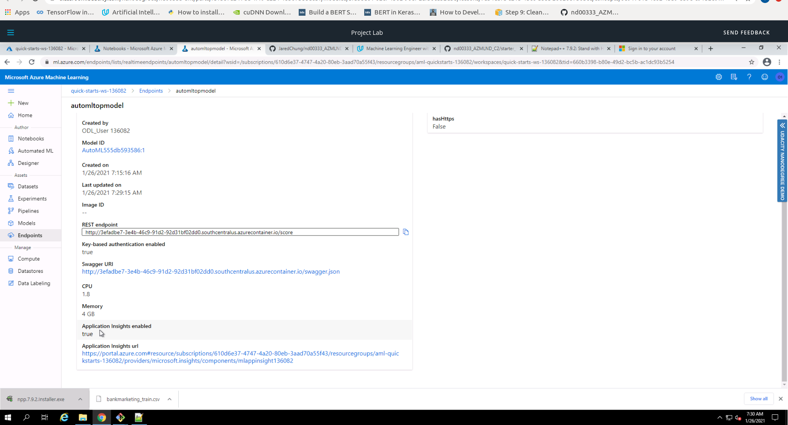

### Step 5 - Swagger Documentation

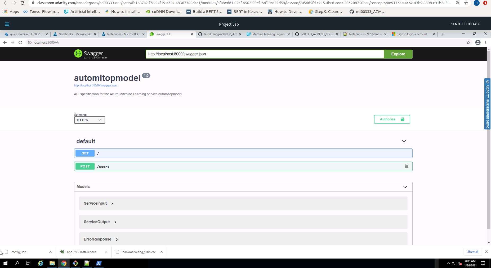

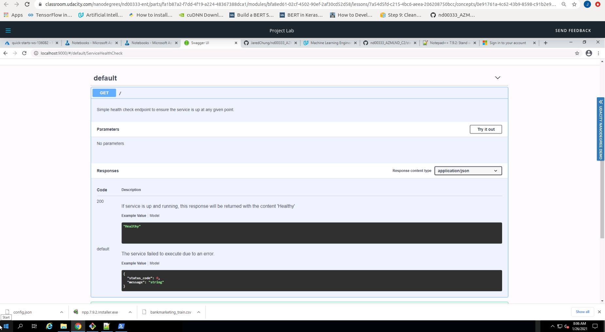

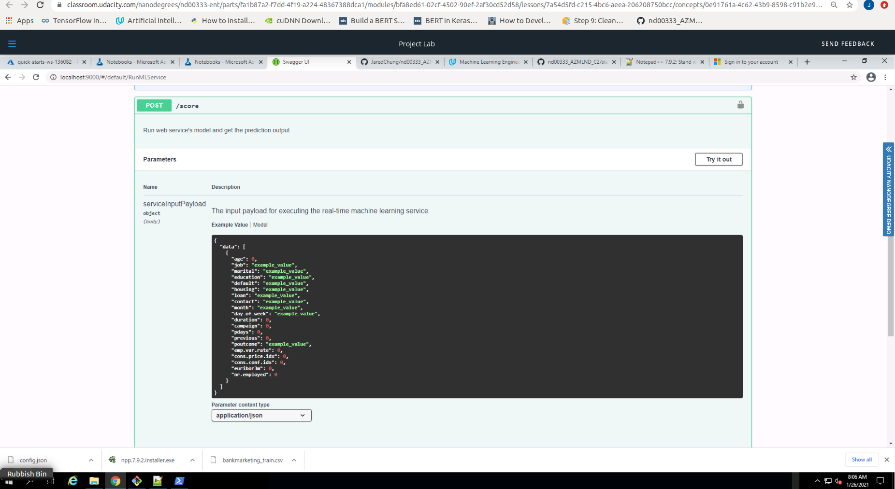

### Step 6 - Consume Model Endpoints

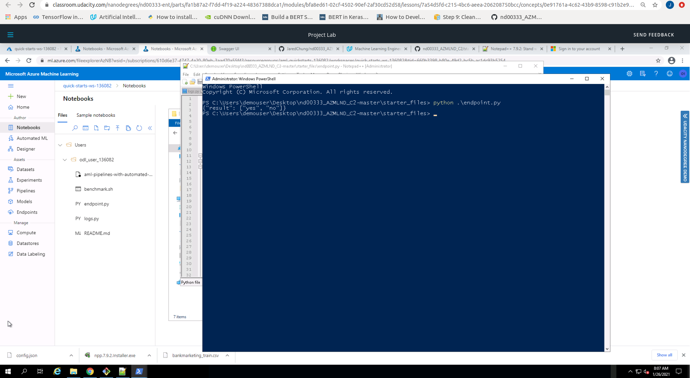

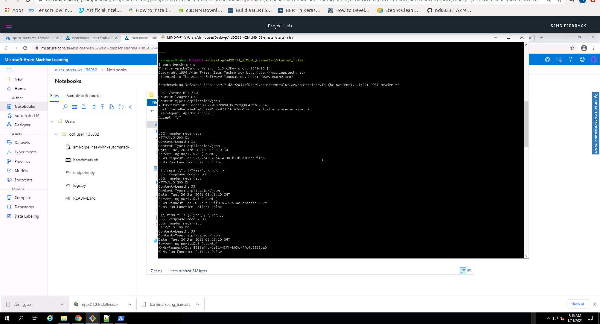

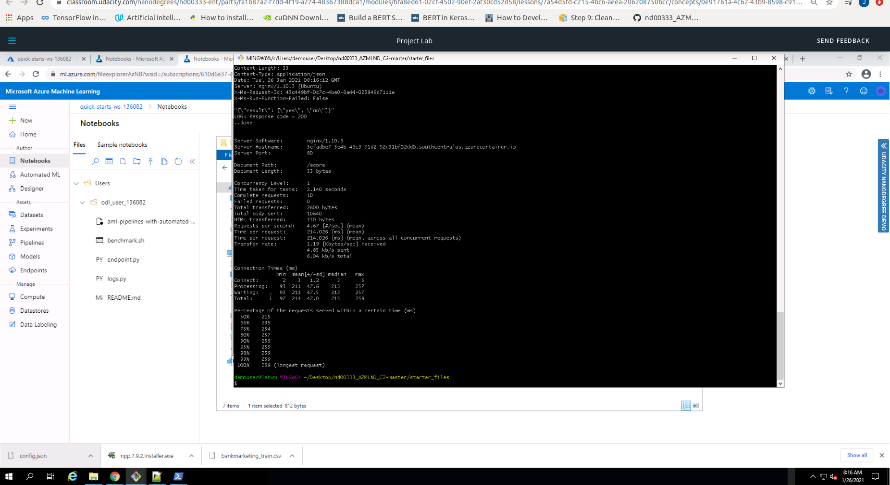

### Step 7 - Create and Publish a Pipeline

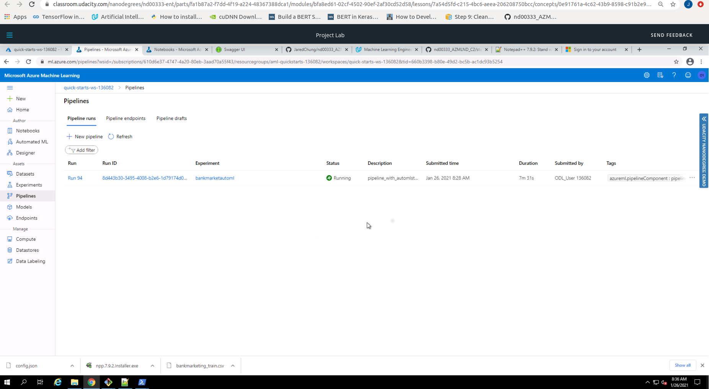

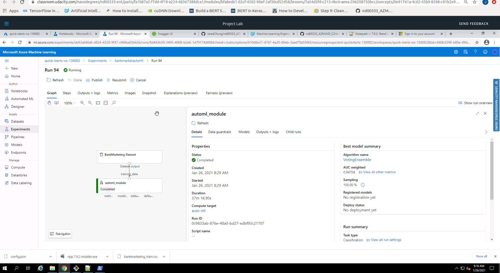

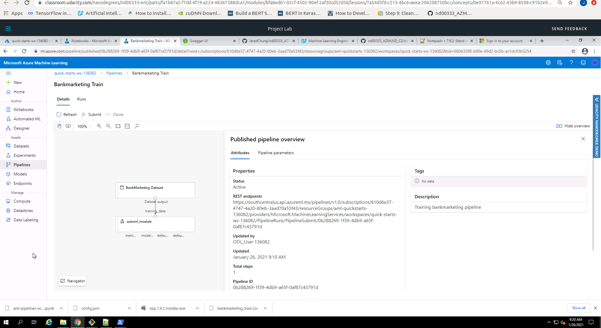

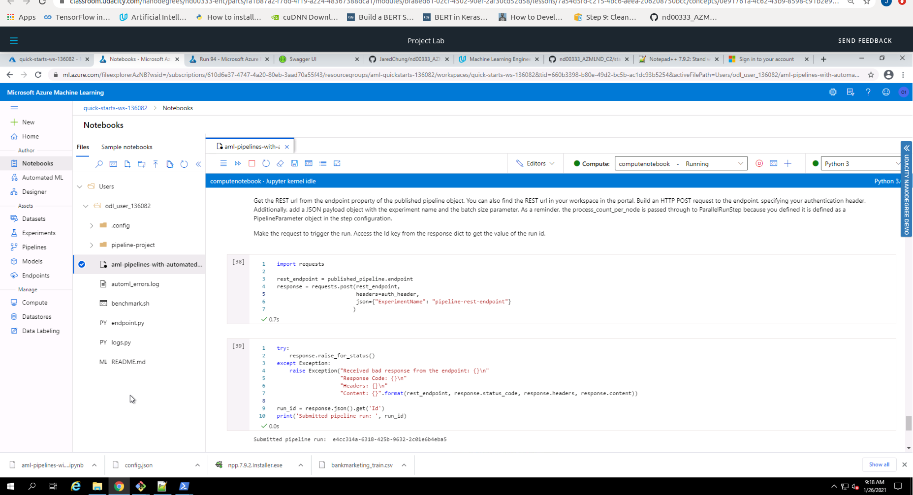

## Screen Recording

https://www.youtube.com/watch?v=AFL9PlokgjA

## Standout Suggestions
*TODO (Optional):* This is where you can provide information about any standout suggestions that you have attempted.
